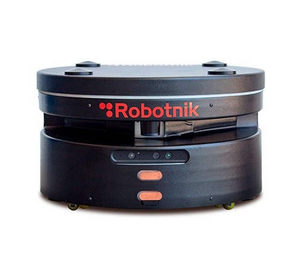

# rb1_base_sim


Packages for the simulation of the RB-1 Base

 

## Packages

### rb1_base_gazebo

This package contains the configuration files and worlds to launch the Gazebo environment along with the simulated robot.

### rb1_base_sim_bringup

Launch files that launch the complete simulation of the robot/s.


## Simulating RB-1 Base

## 1. Install the following dependencies:
  - rb1_base_common [link](https://github.com/RobotnikAutomation/rb1_base_common/tree/update_structure)
  - robotnik_msgs [link](https://github.com/RobotnikAutomation/robotnik_msgs)
  - robotnik_sensors [link](https://github.com/RobotnikAutomation/robotnik_sensors)
  - robotnik_base_hw_sim [link](https://github.com/RobotnikAutomation/robotnik_base_hw_sim)
  - robot_localization_utils [link](https://github.com/RobotnikAutomation/robot_localization_utils)
  - robotnik_gazebo_models [link](https://github.com/RobotnikAutomation/robotnik_gazebo_models.git)
  - procedures_msgs [link](https://github.com/RobotnikAutomation/procedures_msgs.git)
  - marker_mapping [link](https://github.com/RobotnikAutomation/marker_mapping.git)
  - robot_local_control_msgs [link](https://github.com/RobotnikAutomation/robot_local_control_msgs.git)
  - robotnik_navigation [link](https://github.com/RobotnikAutomation/robotnik_navigation.git)
  - rostful [link](https://github.com/RobotnikAutomation/rostful.git)
  - robot_local_control [link](https://github.com/RobotnikAutomation/robot_local_control.git)
  - rcomponent [link](https://github.com/RobotnikAutomation/rcomponent.git)
  - battery_manager [link](https://github.com/RobotnikAutomation/battery_manager.git)
  
    Rostful requires jwt:
    ```
    pip install PyJWT
    ```  

    In the workspace install the packages dependencies:
    ```bash
    rosdep install --from-paths src --ignore-src -r -y
    ```

## 2. Launch RB-1 Base simulation (1 robot by default, up to 3 robots): 
### RB-1 Base: 
  ```
  roslaunch rb1_base_sim_bringup rb1_base_complete.launch
  ```

  Optional general arguments:
  ```xml
  <arg name="launch_rviz" default="true"/>
  <arg name="gazebo_world" default="$(find rb1_base_gazebo)/worlds/rb1_base_office.world"/>
  <arg name="launch_base_hw_sim" default="true"/> <!-- Emulates Robotnik Base HW -->
  <arg name="launch_elevator_fake_pickup_gazebo" default="true"/> <!-- avoids Gazebo physics to pick carts-->

  ```
  Optional robot arguments:
  ```xml
  <!--arguments for each robot (example for robot A)-->
  <arg name="id_robot_a" default="robot"/>
  <arg name="launch_robot_a" default="true"/>
  <arg name="has_elevator_robot_a" default="true"/>
  <arg name="x_init_pose_robot_a" default="0.0" />
  <arg name="y_init_pose_robot_a" default="0.0" />
  <arg name="z_init_pose_robot_a" default="0.0" />
  <arg name="init_yaw_robot_a" default="0.0" />
  <arg name="gmapping_robot_a" default="false"/>
  <arg name="amcl_and_mapserver_robot_a" default="true"/>
  <arg name="map_frame_robot_a" default="$(arg id_robot_a)_map"/>
  <arg name="map_file_robot_a" default="$(find rb1_base_localization)/maps/willow_garage/willow_garage.yaml"/>
  <arg name="move_base_robot_a" default="true"/>
  <arg name="navigation_robot_a" default="true"/> <!-- Launch robotnik_navigation nodes (move, docking, etc.) -->
  <arg name="pad_robot_a" default="true"/>
  <arg name="perception_robot_a" default="true"/> <!-- Launch robotnik perception nodes (camera locator, pose filter, etc.) -->
  <arg name="reflector_locator_robot_a" default="true"/> <!-- Use reflector laser locator to improve objects detection -->
  <arg name="rlc_robot_a" default="true"/>
  <arg name="rostful_robot_a" default="true"/>
  <arg name="rostful_host_robot_a" default="192.168.0.200"/>
  <arg name="rostful_port_robot_a" default="8080"/>
  ```
  
- Example to launch simulation with 3 RB-1 Base robots:
```
roslaunch rb1_base_sim_bringup rb1_base_complete.launch launch_robot_b:=true launch_robot_c:=true
```
- Example to launch simulation with 1 RB-1 Base robot with navigation and localization:
```
roslaunch rb1_base_sim_bringup rb1_base_complete.launch move_base_robot_a:=true amcl_and_mapserver_a:=true
```
- Example to launch simulation with 2 RB-1 Base robot with navigation and localization sharing the same global frame:
```
roslaunch rb1_base_sim_bringup rb1_base_complete.launch amcl_and_mapserver_a:=true move_base_robot_a:=true map_frame_a:=/map launch_robot_b:=true amcl_and_mapserver_b:=true move_base_robot_b:=true map_frame_b:=/map
```
- Example to launch simulation with 3 RB-1 Base robot with navigation and localization sharing the same global frame:
```bash
  roslaunch rb1_base_sim_bringup rb1_base_complete.launch \
    amcl_and_mapserver_a:=true \
    move_base_robot_a:=true \
    map_frame_a:=/map \
    launch_robot_b:=true \
    amcl_and_mapserver_b:=true \
    move_base_robot_b:=true \
    map_frame_b:=/map \
    launch_robot_c:=true \
    amcl_and_mapserver_c:=true \
    move_base_robot_c:=true \
    map_frame_c:=/map
```
roslaunch rb1_base_sim_bringup rb1_base_complete.launch amcl_and_mapserver_a:=true move_base_robot_a:=true map_frame_a:=/map launch_robot_b:=true amcl_and_mapserver_b:=true move_base_robot_b:=true map_frame_b:=/map launch_robot_c:=true amcl_and_mapserver_c:=true move_base_robot_c:=true map_frame_c:=/map
```
### RB-1 Base Dual Arm 

- Example to launch rb1_base with two ur arms:
```bash
roslaunch rb1_base_sim_bringup rb1_base_complete.launch arm_model_robot_a:=dual_ur3 launch_arm_robot_a:=true
```

- In case you want to use moveit to manipulate the arms: 
```bash
roslaunch rb1_base_sim_bringup rb1_base_complete.launch arm_model_robot_a:=dual_ur3 launch_arm_robot_a:=true moveit_movegroup_a:=true
```

## Enjoy! 
You can use the topic "{id_robot}/robotnik_base_control/cmd_vel" to control the RB-1 Base robot or send simple goals using "/{id_robot}/move_base_simple/goal"
