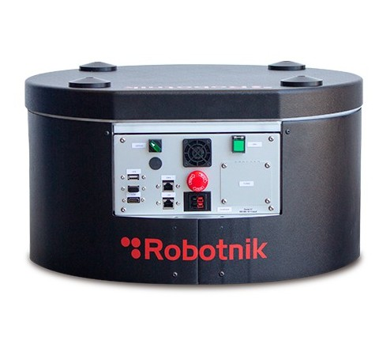

# rb1_base_sim


Packages for the simulation of the RB-1 Base

 
<!--  -->

## Packages

### rb1_base_gazebo

This package contains the configuration files and worlds to launch the Gazebo environment along with the simulated robot.

### rb1_base_sim_bringup

Launch files that launch the complete simulation of the robot/s.


## Simulating RB-1 Base

1. Install the following dependencies:
  - rb1_base_common [link](https://github.com/RobotnikAutomation/rb1_base_common)
  - robotnik_msgs [link](https://github.com/RobotnikAutomation/robotnik_msgs)
  - robotnik_sensors [link](https://github.com/RobotnikAutomation/robotnik_sensors)
  - robotnik_base_hw_sim [link](https://github.com/RobotnikAutomation/robotnik_base_hw_sim)
  - robot_localization_utils [link](https://github.com/RobotnikAutomation/robot_localization_utils)

    In the workspace install the packages dependencies:
    ```bash
rosdep install --from-paths src --ignore-src -r -y
    ```

2. Launch RB-1 Base simulation (1 robot by default, up to 3 robots):
- RB-1 Base:
  ```bash
roslaunch rb1_base_sim_bringup rb1_base_complete.launch
  ```

  Optional general arguments:
  ```xml
  <arg name="launch_rviz" default="true"/>
  <arg name="gazebo_world" default="$(find rb1_base_gazebo)/worlds/rb1_base_office.world"/>

  ```
  Optional robot arguments:
  ```xml
  <!--arguments for each robot (example for robot A)-->
  <arg name="id_robot_a" default="rb1_base_a"/>
  <arg name="launch_robot_a" default="true"/>
  <arg name="map_file_a" default="$(find rb1_base_localization)/maps/willow_garage/willow_garage.yaml"/>
  <arg name="localization_robot_a" default="true"/>
  <arg name="gmapping_robot_a" default="false"/>
  <arg name="move_base_robot_a" default="false"/>
  <arg name="amcl_and_mapserver_a" default="false"/>
  <arg name="x_init_pose_robot_a" default="0" />
  <arg name="y_init_pose_robot_a" default="0" />
  <arg name="z_init_pose_robot_a" default="0" />
  <arg name="xacro_robot_a" default="rb1_base_std.urdf.xacro"/>
  <arg name="map_frame_a" default="$(arg id_robot_a)_map"/>
  <arg name="launch_base_hw_sim" default="false"/> <!-- Emulates Robotnik Base HW -->
  <arg name="launch_elevator_fake_pickup_gazebo" default="false"/> <!-- avoids Gazebo physics to pick carts -->
  <arg name="move_robot_a" default="false"/> <!-- as long as robotnik_navigation pkg is installed -->
  ```
- Example to launch simulation with 3 RB-1 Base robots:
  ```bash
roslaunch rb1_base_sim_bringup rb1_base_complete.launch \
  launch_robot_b:=true \
  launch_robot_c:=true
  ```
- Example to launch simulation with 1 RB-1 Base robot with navigation and localization:
  ```bash
roslaunch rb1_base_sim_bringup rb1_base_complete.launch \
  move_base_robot_a:=true \
  amcl_and_mapserver_a:=true
  ```
- Example to launch simulation with 2 RB-1 Base robot with navigation and localization sharing the same global frame:
  ```bash
roslaunch rb1_base_sim_bringup rb1_base_complete.launch \
  amcl_and_mapserver_a:=true \
  move_base_robot_a:=true \
  map_frame_a:=/map \
  launch_robot_b:=true \
  amcl_and_mapserver_b:=true \
  move_base_robot_b:=true \
  map_frame_b:=/map
  ```
- Example to launch simulation with 3 RB-1 Base robot with navigation and localization sharing the same global frame:
```bash
roslaunch rb1_base_sim_bringup rb1_base_complete.launch \
  amcl_and_mapserver_a:=true \
  move_base_robot_a:=true \
  map_frame_a:=/map \
  launch_robot_b:=true \
  amcl_and_mapserver_b:=true \
  move_base_robot_b:=true \
  map_frame_b:=/map \
  launch_robot_c:=true \
  amcl_and_mapserver_c:=true \
  move_base_robot_c:=true \
  map_frame_c:=/map
```
3. Enjoy! You can use the topic `${id_robot}/robotnik_base_control/cmd_vel` to control the RB-1 Base robot or send simple goals using `/${id_robot}/move_base_simple/goal`
